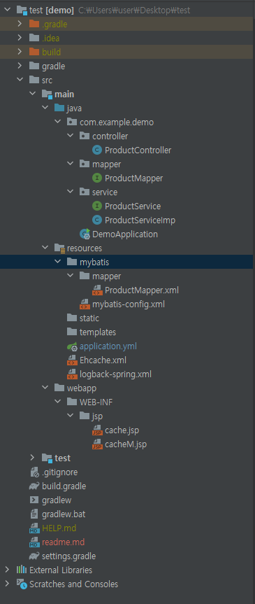
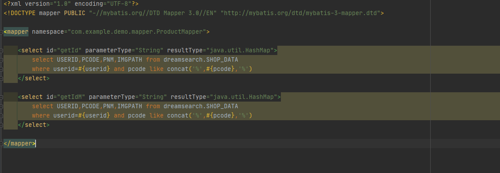
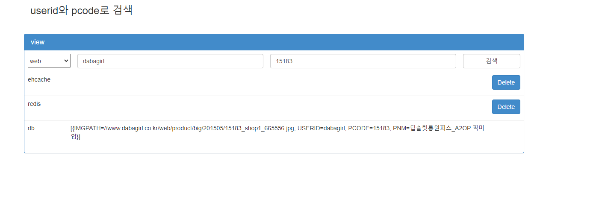

# Ehcache & Redis

-name : Kim taegang

-Tools : IntelliJ, Redis, Spring boot, Mybatis etc

-explain : ehcache - redis - db 를 순서로 안에 있는 데이터를 조회

-URL 

* web	  : http://localhost:8080/getId?userid={userid}&pcode={pcode}

* mobile : http://localhost:8080/getIdM?userid={userid}&pcode={pcode}

  

## Ehcache

-EHCache란 Java의 대표적인 캐시 엔진 중의 하나이다

#### 특징 

* 경량의 빠른 캐시 엔진
* 메모리, 디스크 저장 지원, 멀티 CPU의 동시 접근에 튜닝
* 동기, 비동기 복사, 피어 자동 발견

## Redis

-REDIS(REmote Dictionary Server)는 메모리 기반의 '키-값' 구조 데이터 관리 시스템이며, 모든 데이터를 메모리에 저장하고 조회하기에 빠른 Read, Write 속도를 보장하는 비 관계형 데이터 베이스이다.

#### 장점

* 리스트, 배열과 같은 데이터를 처리하는데 유용하다.

  value 값으로 문자열, 리스트, Set Sorted Set, Hash 등 여러 데이터 형식을 지원하기에, 다양한 방식으로 데이터를 활요할 수 있다.

* 리스트형 데이터 입력과 삭제가 MySQL에 비해서 10배정도로 빠르다고 한다.

  여러 프로세스에서 동시에 같은 key에 대한 갱신을 요청할 경우, Atomic 처리로 데이터 부정합 방지 Automic처리 함수를 제공한다.(원자성을 잘 지킨다.)

* 메모리를 활용하면서 영속적인 데이터 보존

  명령어로 명시적으로 삭제, expires를 설정하지 않으면 데이터가 삭제되지 않는다.

  스냅샷(기억장치) 기능을 제공하여 메모리의 내용을 *.rdb 파일로 저장하여 해당 시점으로 복구할 수 있다.

#### 결론

1. 처리속도가 빠르다.
2. 데이터가 메모리 +disk에 저장된다.
3. 만료일을 지정, 만료가되면 데이터가 자동 삭제된다.
4. 저장소 메모리 재사용 하지 않는다.
5. 다양한 Data Type을 지원한다.

### Directory

#### Query

* like문과 concat함수를 통해서 입력한 pcode값이 포함되는 값을 출력되도록 설정

#### VIEW

* 기능

  1. userid와 pcode를 입력해서 검색 가능
  2. category 선택을 통해서 web과 mobile버전중 선택해서 검색 가능
  3. Ehcache 와 Redis  cache 삭제 기능
  4. log 기록 저장

